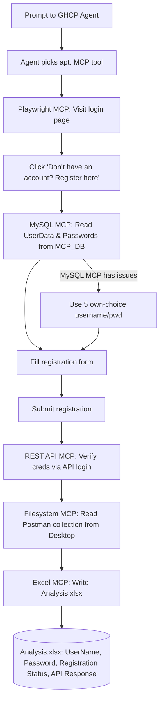

# Mini E2E MCP Workflow

> Prompt the AI Agent --> Agent will choose apt. MCP tool -> Execute the instructions

To actually execute these instructions, we need to enable LLM with capabilities via MCP.

## MCP Server Setups

We need the below MCP Server setups.

### 1. Web UI Interaction: microsoft/playwright-mcp

**Purpose:** Drives a real browser (navigate, click, fill forms, read page snapshots/network calls) so the agent can automate web UI interactions.
**Used here:** Visits the login page, opens the registration form, fills in user details, and submits the registration for each test user.

Installed server via cmd in VS Code instead of adding the github repo's json in `.vscode/mcp.json` file:

```powershell
code --add-mcp '{"name":"playwright","command":"npx","args":["@playwright/mcp@latest"]}'
```

### 2. MySQL Interaction: designcomputer/mysql_mcp_server

**Purpose:** Lets the agent query a MySQL database directly, without hand-written SQL scripts.
**Used here:** Reads the `UserData` and `Passwords` tables from the `MCP_DB` database to source the registration form data. Falls back to 5 self-chosen username/password pairs if this server is unavailable.

```powershell
pip install mysql-mcp-server
```

Path of installation: `C:\Users\<MaskedUsername>\AppData\Local\Programs\Python\Python313\Lib\site-packages\mysql_mcp_server`

Installed server via cmd in VS Code instead of adding the github repo's json in `.vscode/mcp.json` file:

```powershell
code --add-mcp '{\"name\":\"mysql\",\"command\":\"uv\",\"args\":[\"--directory\",\"C:\\Users\\Admin\\AppData\\Local\\Programs\\Python\\Python313\\Lib\\site-packages\\mysql_mcp_server\",\"run\",\"mysql_mcp_server\"],\"env\":{\"MYSQL_HOST\":\"127.0.0.1\",\"MYSQL_PORT\":\"3306\",\"MYSQL_USER\":\"Admin\",\"MYSQL_PASSWORD\":\"Admin@123\",\"MYSQL_DATABASE\":\"MCP_DB\"}}'
```

### 3. REST API MCP Server

**Purpose:** Sends REST API requests (GET/POST/etc.) and returns status codes/responses, so the agent can test APIs without writing HTTP client code.
**Used here:** Calls the login API to verify each newly registered user's credentials and captures the response status code for the report.

```powershell
npm install -g dkmaker-mcp-rest-api

code --add-mcp '{\"name\":\"rest-api\",\"command\":\"node\",\"args\":[\"C:/Users/<MaskedUsername>/AppData/Roaming/npm/node_modules/dkmaker-mcp-rest-api/build/index.js\"],\"env\":{\"REST_BASE_URL\":\"https://rahulshettyacademy.com\"}}'
```

### 4. File System MCP Server - To read Postman collection file

**Purpose:** Gives the agent read/write access to a specific local directory on disk.
**Used here:** Reads the Postman collection file (containing the API endpoint details) from the Desktop so the REST API MCP Server knows what request to send.

```powershell
code --add-mcp ('{"name":"filesystem","command":"cmd","args":["/c","npx","-y","@modelcontextprotocol/server-filesystem","C:/Users/' + $env:USERNAME + '/Desktop"]}' -replace '"','\"')
```

### 5. Excel file MCP server - negokaz/excel-mcp-server

**Purpose:** Reads from and writes to Excel workbooks (sheets, ranges, tables) directly on disk.
**Used here:** Writes the final `Analysis.xlsx` report with the username, password, registration status, and API response status code for each test user.

```powershell
$m='{"name":"excel","command":"cmd","args":["/c","npx","--yes","@negokaz/excel-mcp-server"],"env":{"EXCEL_MCP_PAGING_CELLS_LIMIT":"4000"}}'; code --add-mcp ($m -replace '"','\"')
```

## Current Table

| # | FirstName | LastName | email | Password |
|---|---|---|---|---|
| 1 | TestName1 | TestSurname1 | testuser1@gmail.com | PWD_1 |
| 2 | TestName2 | TestSurname2 | testuser2@gmail.com | PWD_2 |
| 3 | TestName3 | TestSurname3 | testuser3@gmail.com | PWD_3 |
| 4 | TestName4 | TestSurname4 | testuser4@gmail.com | PWD_4 |

## Workflow Diagram



## Prompt to GHCP Agent

```text
Visit https://rahulshettyacademy.com/client/#/auth/login
Wait for the page to be fully loaded
Click on Don't have an account? Register here

To fill the formdata from Tables UserData and Passwords From Database MCP_DB
For other data not in the mysql tables, you can fill accordingly

After registration, verify this user creds via API login

Read the collection from Desktop

Write the excel file in the following way
Column-1: UserName -> Write username u used
Column-2: Password -> Write Password u used
Column-3: Registration Status -> If user is registered successfully -> Yes, else No
Column-4: API Response after you hit REST API from collection -> Status code

Excel file to be created - Name = "Analysis.xlsx"

If MySQL MCP has issues, give 5 username and pwd from your own choice
```


